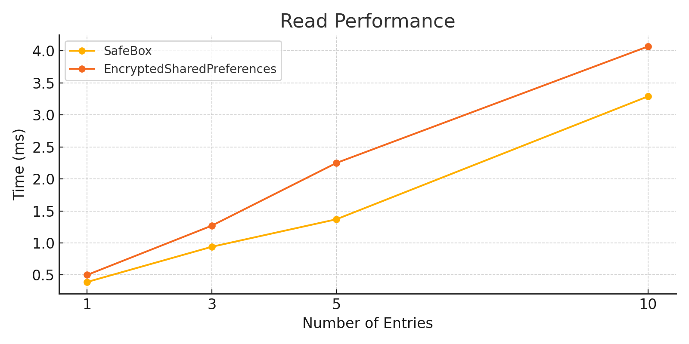
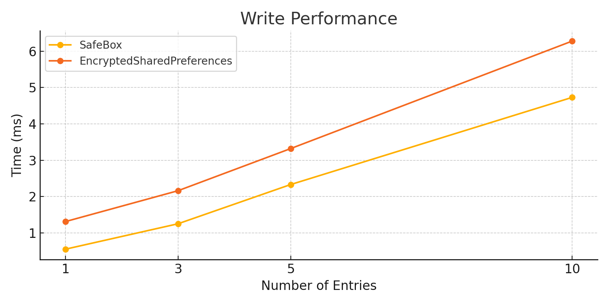
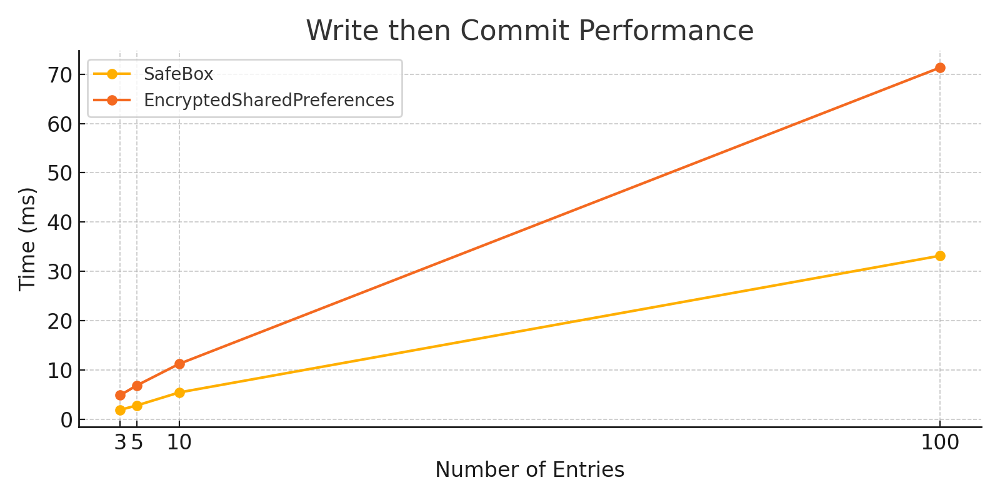

# SafeBox

A secure, blazing-fast alternative to `EncryptedSharedPreferences`, designed for Android projects which demand both **speed** and **security**.

## 🚨 EncryptedSharedPreferences is Deprecated
As of **Jetpack Security 1.1.0-alpha07 (April 9, 2025)**, `EncryptedSharedPreferences` has been deprecated with no official replacement. Without continued support from Google, it may fall behind in cryptography standards, leaving sensitive data exposed.

SafeBox can help you [migrate](docs/MIGRATION.md) easily using the same `SharedPreferences` API.

## Why SafeBox?

| Feature             | SafeBox                           | EncryptedSharedPreferences                |
|---------------------|-----------------------------------|-------------------------------------------|
| Initialization Time | **0.35ms** (*110x faster*)        | 38.7ms                                    |
| Storage Format      | Memory-mapped binary file         | XML-based per-entry                       |
| Encryption Method   | ChaCha20-Poly1305 (keys & values) | AES-SIV for keys, AES-GCM for values      |
| Key Security        | Android Keystore-backed AES-GCM   | Android Keystore MasterKey (*deprecated*) |
| Customization       | Pluggable cipher/key providers    | Tightly coupled                           |

SafeBox uses **deterministic encryption** for reference keys (for fast lookup) and **non-deterministic encryption** for values (for strong security). Both powered by a single ChaCha20 key protected via AES-GCM and stored securely.

### SafeBox Key Derivation & Encryption Flow

```
 [Android Keystore-backed AES-GCM Key]
                  ↓
       [ChaCha20-Poly1305 Key]
              ↙       ↘
    Reference Keys    Entry Values
(deterministic IV)    (randomized IV)
```

Compared to EncryptedSharedPreferences:

```
[Android Keystore MasterKey (deprecated)]
           ↙             ↘
    [AES-SIV Key]    [AES-GCM Key]
         ↓                 ↓
   Reference Keys     Entry Values

```

## Performance Benchmarks

Average times measured over **100 samples** on an emulator:







<details>

<summary>📊 Comparison Tables</summary>

| Operation                    | SafeBox    | EncryptedSharedPreferences |
|------------------------------|------------|----------------------------|
| Write 1 entry then commit    | **0.55ms** | 1.31ms (*138% slower*)     |
| Read 1 entry                 | **0.39ms** | 0.50ms (*28% slower*)      |
| Write 3 entries then commit  | **1.25ms** | 2.16ms (*73% slower*)      |
| Read 3 entries               | **0.94ms** | 1.27ms (*35% slower*)      |
| Write 5 entries then commit  | **2.33ms** | 3.32ms (*42% slower*)      |
| Read 5 entries               | **1.37ms** | 2.25ms (*64% slower*)      |
| Write 10 entries then commit | **4.73ms** | 6.28ms (*33% slower*)      |
| Read 10 entries              | **3.29ms** | 4.07ms (*24% slower*)      |

Even on **multiple single commits**, SafeBox remains faster:

| Operation                    | SafeBox     | EncryptedSharedPreferences |
|------------------------------|-------------|----------------------------|
| Write and commit 3 entries   | **1.94ms**  | 4.9ms (*152% slower*)      |
| Write and commit 5 entries   | **2.84ms**  | 6.91ms (*143% slower*)     |
| Write and commit 10 entries  | **5.47ms**  | 11.27ms (*106% slower*)    |
| Write and commit 100 entries | **33.19ms** | 71.34ms (*115% slower*)    |

</details>

## Installation

```kotlin
dependencies {
    implementation("io.github.harrytmthy-dev:safebox:1.1.0-rc01")
}
```

## Basic Usage

First, provide SafeBox as a singleton:

```kotlin
@Singleton
@Provides
fun provideEncryptedSharedPreferences(@ApplicationContext context: Context): SharedPreferences =
    SafeBox.create(context, PREF_FILE_NAME) // Ensuring single instance per file
```

Then use it like any `SharedPreferences`:

```kotlin
prefs.edit()
    .putInt("userId", 123)
    .putString("name", "Luna Moonlight")
    .apply()

val userId = prefs.getInt("userId", -1)
val email = prefs.getString("email", null)
```

<details>

<summary>⚠️ Anti-Patterns</summary>

#### ❌ Do NOT create multiple SafeBox instances with the same file name before closing the previous one

```kotlin
fun saveUsername(value: String) {
    SafeBox.create(context, PREF_FILE_NAME)
        .edit { putString("username", value) } // ❌ New instance per function call
}
```

This may cause FileChannel conflicts, memory leaks, or stale reads across instances.

---

#### ⚠️ Avoid scoping SafeBox to short-lived components

```kotlin
@Module
@InstallIn(ViewModelComponent::class) // ⚠️ New instance per ViewModel
object SomeModule {
    
    @Provides
    fun provideSafeBox(@ApplicationContext context: Context): SafeBox =
        SafeBox.create(context, PREF_FILE_NAME)
}

class HomeViewModel @Inject constructor(private val safeBox: SafeBox) : ViewModel() {

    override fun onCleared() {
        safeBox.closeWhenIdle() // Technically safe, but why re-create SafeBox for every ViewModel?
    }
}
```

</details>

### Observing State Changes

You can observe SafeBox lifecycle state transitions (`STARTING`, `WRITING`, `IDLE`, `CLOSED`) in two ways:

#### 1. Instance-bound listener

```kotlin
val safeBox = SafeBox.create(
    context = context,
    fileName = PREF_FILE_NAME,
    listener = SafeBoxStateListener { state ->
        when (state) {
            STARTING -> trackStart()    // Loading data into memory
            IDLE     -> trackIdle()     // No active operations
            WRITING  -> trackWrite()    // Writing to disk
            CLOSED   -> trackClose()    // Instance is no longer usable
        }
    }
)
```

#### 2. Global observer

Manually add listeners by file name:

```kotlin
val listener = SafeBoxStateListener { state ->
    when (state) {
        STARTING -> trackStart()    // Loading data into memory
        IDLE     -> trackIdle()     // No active operations
        WRITING  -> trackWrite()    // Writing to disk
        CLOSED   -> trackClose()    // Instance is no longer usable
    }
}
SafeBoxGlobalStateObserver.addListener(PREF_FILE_NAME, listener)
```

and remove it when it's no longer needed:

```kotlin
SafeBoxGlobalStateObserver.removeListener(PREF_FILE_NAME, listener)
```

You can also query the current state at any time:

```kotlin
val state = SafeBoxGlobalStateObserver.getCurrentState(PREF_FILE_NAME)
```

## Migrating from EncryptedSharedPreferences

SafeBox is a drop-in replacement for `EncryptedSharedPreferences`.

➡️ [Read the Migration Guide](docs/MIGRATION.md)

## Contributing

See [CONTRIBUTING.md](CONTRIBUTING.md) for setup, formatting, testing, and PR guidelines.

## License

```
MIT License
Copyright (c) 2025 Harry Timothy Tumalewa
```